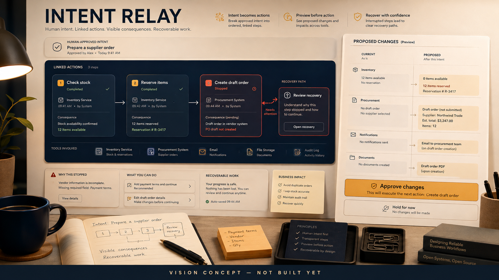

# Intent Relay

**Preview, approve and recover AI-driven work across the tools your organization already uses.**

An agent can call five tools. Who makes sure the work still makes sense when the third call fails?

> This is a public planning repository. There is no product implementation or playable build yet. The image is an AI-generated vision reference, not a screenshot. All waves and tasks are proposed; no completed work, community approval or funding is implied.

## The mission

Build an open execution layer for consequential agent work across applications. Turn a proposed change into inspectable steps, narrow permissions, confirmed effects and a recovery plan that a person can understand.

Ask an agent to prepare a business change. Inspect what will change, approve the permitted steps, follow the actual results and recover a partial failure without guessing which actions happened.

## Who this is for

Developers and operations teams deploying agents into real multi-application workflows.

## The first thing we want to prove

A synthetic supplier-order workflow across inventory, reservation and draft-order services. Demonstrate previews, scoped approval, retries and partial failure recovery before connecting real customer systems.

External tools do not share a transaction manager. Universal rollback and universal exactly-once execution are not credible promises. Expose uncertainty and require reconciliation when a provider cannot prove an effect.

## What this could become

A shared library of connector contracts and recovery semantics that can work across models, agent frameworks and self-hosted business systems.

Tool protocols, durable workflows and governed enterprise agent products already exist. This proposal focuses on open, application-spanning effect descriptions and practical recovery, with honest distinctions between reversible, compensatable and irreversible operations.

## Why build it together

Domain experts and connector maintainers can contribute small effect contracts, fault fixtures and recovery recipes. Their shared knowledge is more valuable than another generic agent wrapper.

We are looking for founding maintainers and contributors who can make one small, reviewable part real. Bring a concrete use case, a difficult test case, an interface sketch or a focused patch. If you use a coding agent, give it one agreed task and review its result. Accepted work matters more than generated volume.

## How to join

Start with [the project on Tanduna](https://tanduna.com/projects/intent-relay). Read the [six-wave roadmap](ROADMAP.md) and [twelve proposed tasks](TASKS.md), then join the planning discussion and say which result you can help deliver. Propose scope before starting overlapping implementation. GitHub holds the source; Tanduna is where we organize the project and its community.

- **W1: Describe the effects before the calls.** Define a minimal contract around intent and consequences.
- **W2: A synthetic workflow with real semantics.** Implement the smallest inspectable multi-service run.
- **W3: Execution that admits uncertainty.** Handle failures without duplicating effects.
- **W4: Connect real tools deliberately.** Prove interoperability and ownership boundaries.
- **W5: Work across teams and frameworks.** Keep permissions and meaning stable as adoption grows.
- **W6: An open recovery commons.** Make operational reliability a maintained community asset.

## What we are not promising

No automatic production writes by default, credential pooling or pretending that sending a message can be undone. Connector access remains with its owner and each irreversible action needs an explicit policy.

There is no delivery date, token target, paid offer or crowdfunding campaign here. Community interest does not guarantee a finished product. The next milestone depends on contributors, maintainer capacity and evidence from the previous one.

## Existing work we should learn from

- [Model Context Protocol](https://modelcontextprotocol.io/docs/getting-started/intro)
- [Temporal](https://docs.temporal.io/)
- [ServiceNow Action Fabric](https://www.servicenow.com/platform/action-fabric.html)

These are related foundations and references, not partners or endorsements. We should reuse compatible components or contribute upstream when that is the better route. This proposal does not claim that its individual ingredients are unprecedented. Dependencies and their licenses will be evaluated before adoption.

## License and contribution

This repository is published under [GNU AGPL-3.0](LICENSE). See [CONTRIBUTING.md](CONTRIBUTING.md) for the proposed contribution workflow and [the image note](assets/README.md) for concept provenance.
